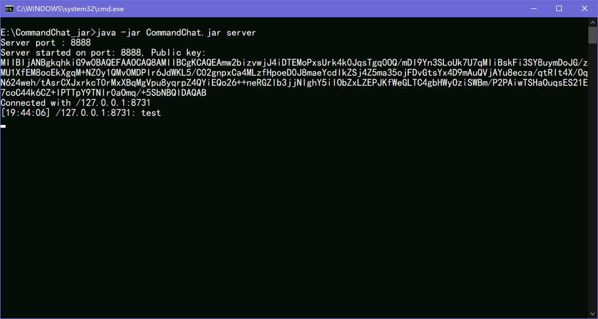
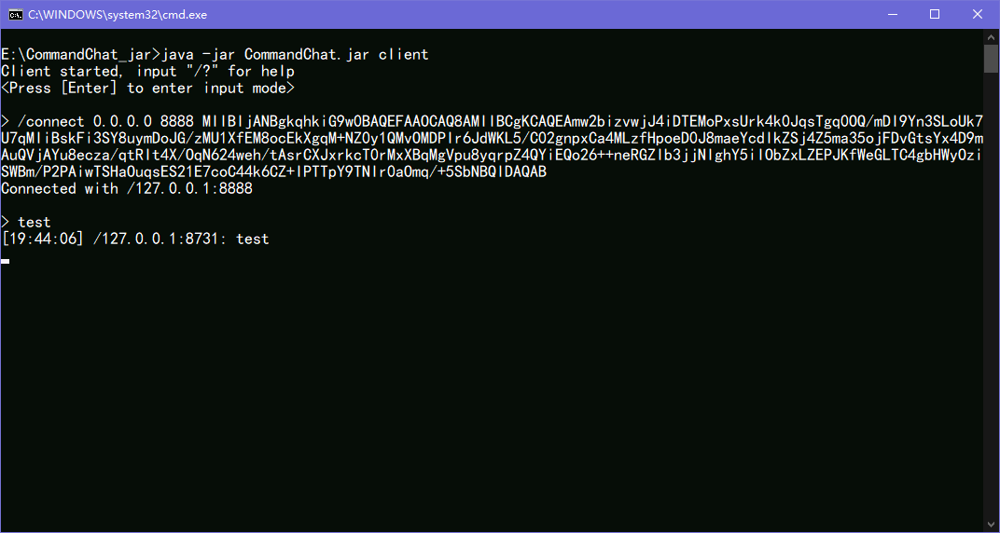

# CommandChat

A simple chat application using SocketChannel, ServerSocketChannel, AES encryption and RSA encryption.
Just trying to learn how to use these things so there are **probably** a lot of bugs. 😥

When you inter the input mode, the message you receive will be temporarily stored in the buffer, and it will be shown on
the screen after you finish typing and press enter. That why you need to press enter before you input something.

## How to use

As you can see, download the jar file, change to its directory and run the following command:

* `java -jar CommandChat.jar server` for server.
* `java -jar CommandChat.jar client` for client.

